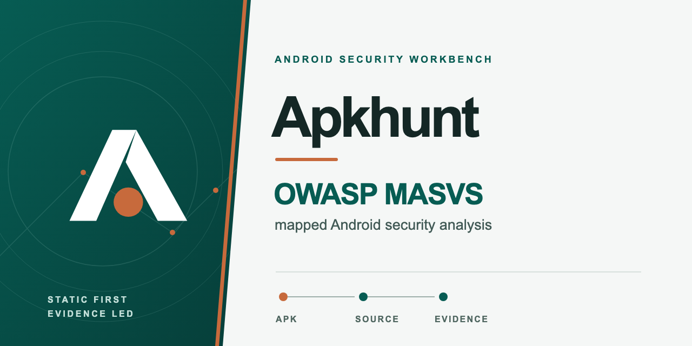
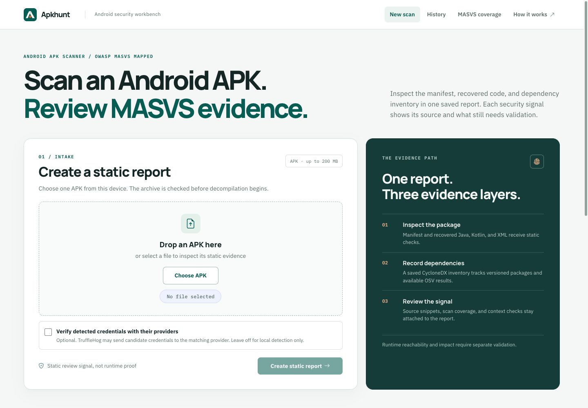
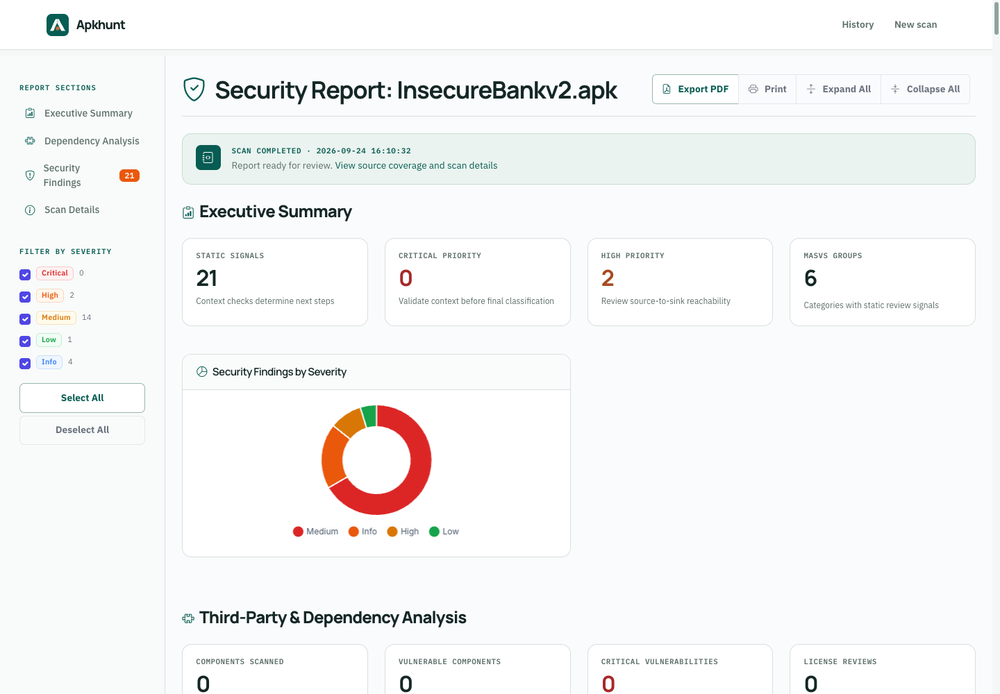
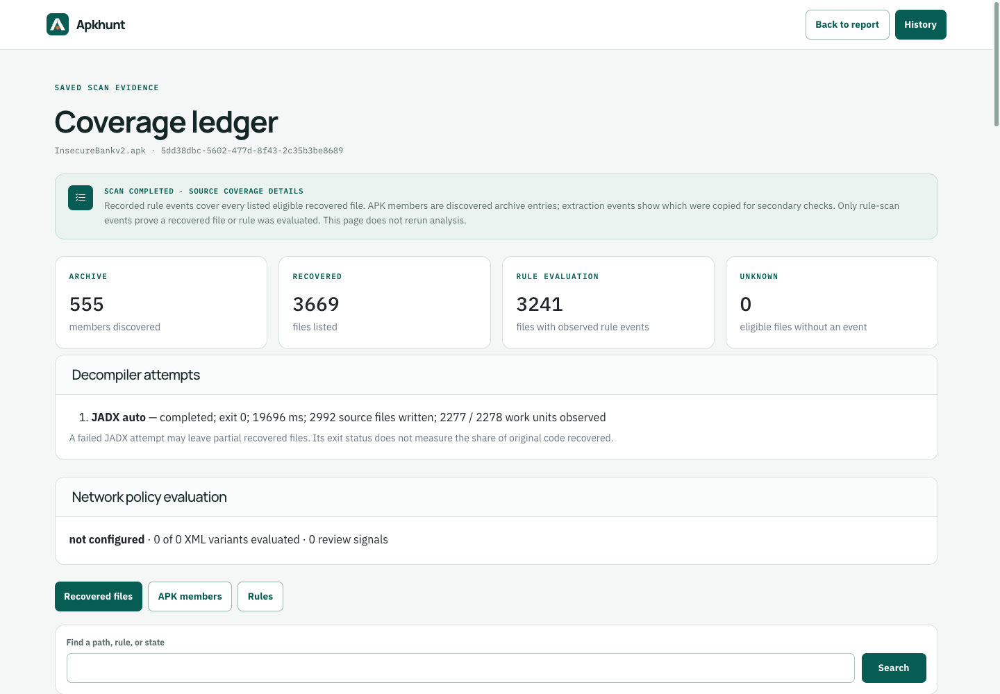
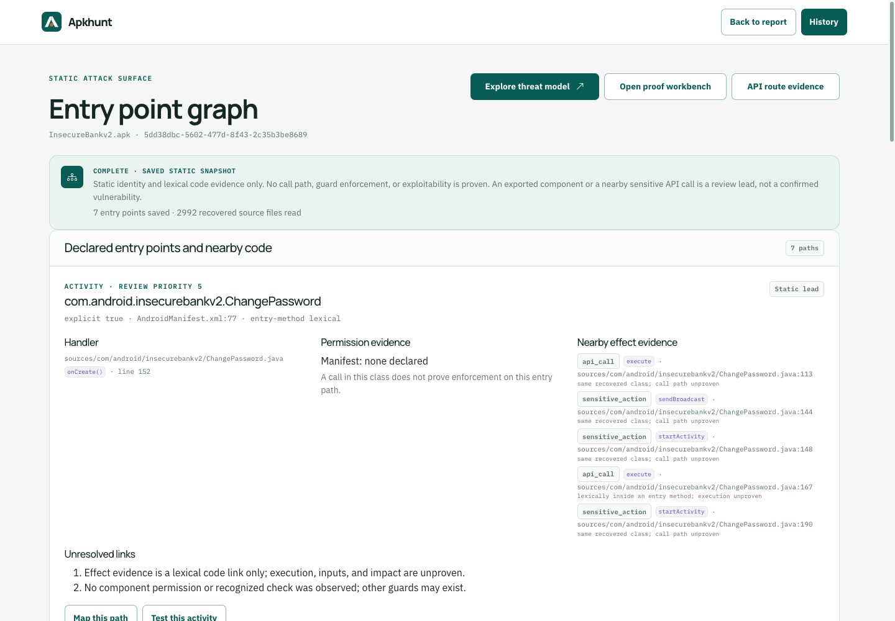
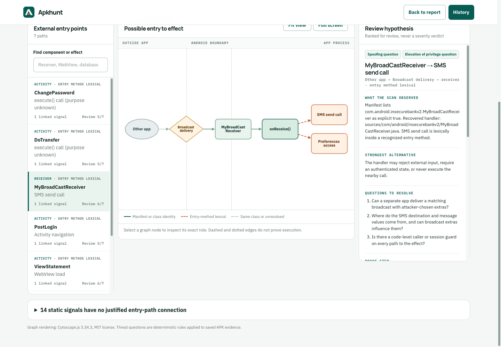
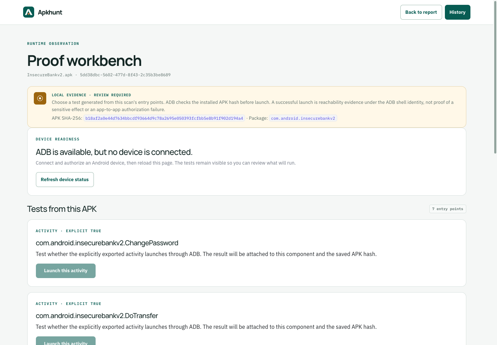
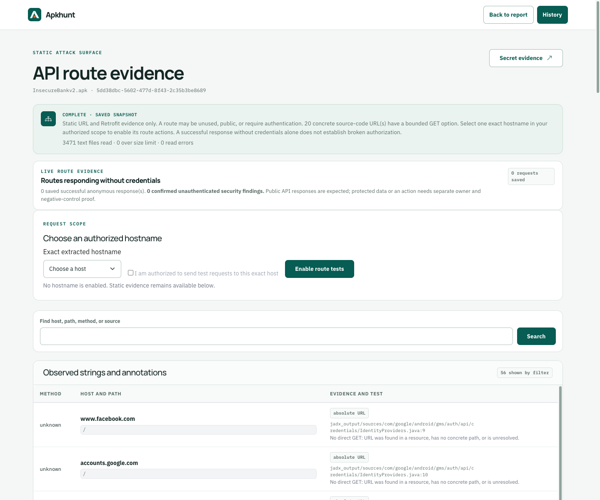
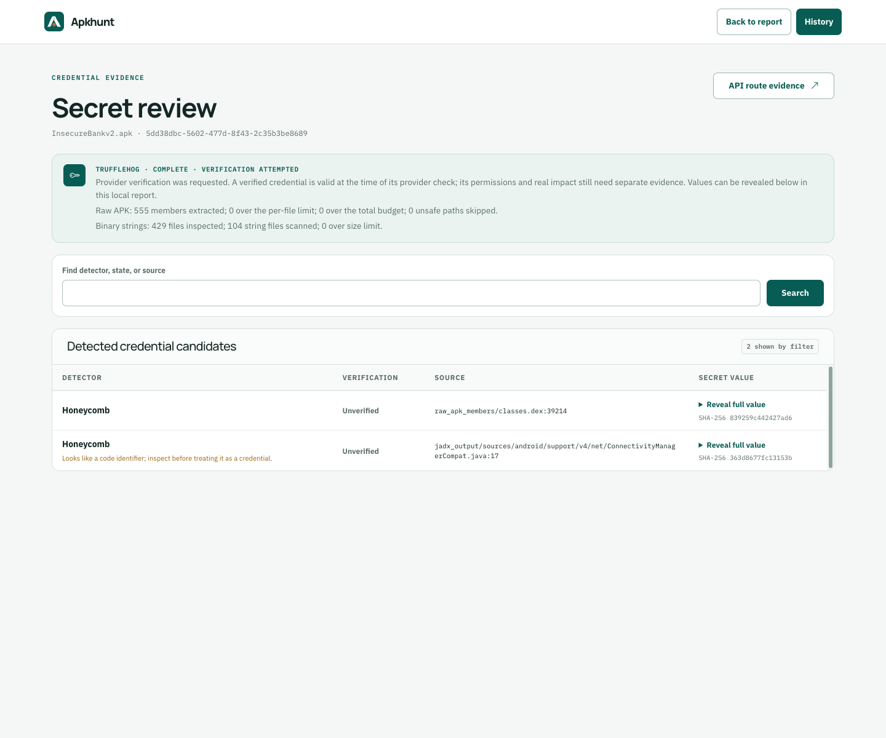

# Apkhunt

Apkhunt is a local Android APK static-analysis workbench. It extracts manifest and code signals, maps static checks to OWASP MASVS groups, captures a CycloneDX SBOM, and enriches versioned package identities through OSV when that service is available. It does not verify MASVS compliance.

Static matches are investigation targets, not proof of runtime reachability or exploitation.

## Screenshots

**Scan intake** — choose an APK and start a background scan.



**Saved report** — review findings, severity, coverage, and dependencies in one place.



### Coverage ledger

Scanned files, rule events, and unknown work.



### Entry point graph

Components, handlers, and nearby calls.



### Threat model

Trust boundaries and review questions.



### Runtime tests

ADB readiness and component-specific tests.



### API route evidence

Saved routes and scoped request controls.



### Secret review

TruffleHog candidates and verification state.



The screenshots use a local InsecureBankv2 sample scan. Secret values remain collapsed, no API host is enabled for live tests, and static signals are not validated vulnerabilities.

## Run with Docker

Requirements:

* Docker Desktop with Docker Compose v2
* A unique application secret

From this directory, start Apkhunt with:

```sh
export SECRET_KEY="$(openssl rand -hex 32)"
docker compose up --build
```

Open [http://localhost:5005](http://localhost:5005).

The Compose stack stores uploads, decompiled output, reports, scan history, and worker status in named Docker volumes. Stop it with `docker compose down`. Add `--volumes` only when you intentionally want to remove all saved scan data. An app restart interrupts a running worker; the restored status marks that scan as interrupted instead of claiming it is still running.

## What a scan does

1. Accepts an APK up to 200 MB by default and validates its ZIP structure before queuing a background scan. The page returns immediately; the scan status dock follows navigation across the app.
2. Runs one scan at a time, uses JADX first, retries simplified JADX output after an auto-mode error, and retries bounded individual DEX files only if APK-level attempts leave no usable Java/Kotlin source. Per-DEX rescue uses `--show-bad-code`; that flag is optional for the initial APK passes because it significantly slowed the reference APK without resolving its method errors. Apktool supplies fallback manifest and resources when JADX returns errors. The dock shows completed processing stages and elapsed time. When JADX emits work-unit progress, that percentage applies only to the current JADX attempt, not to the whole scan.
3. Evaluates structural manifest rules and the manifest-linked Network Security Configuration, then recursively walks recovered JADX files for static rules. It reads eligible text files up to 10 MB each; only Java, Kotlin, and XML currently have security rules. The report records scanned and skipped-file counts. Apktool fallback uses the manifest and selected resources; it also decodes Smali, whose file count is reported separately because Java/Kotlin rules do not inspect Smali instructions.
4. Creates a CycloneDX SBOM with Syft when available.
5. Queries OSV once for each versioned package URL and preserves unavailable or unknown states instead of inventing a severity.
6. Saves a separate static API route inventory and a TruffleHog credential-candidate snapshot. Android XML namespace URLs are ignored; query strings and token-like path segments are removed from route evidence. No extracted host is contacted. TruffleHog does not verify with providers unless the upload explicitly opts in. The secret review page reveals full candidate values on request.
7. Saves a coverage ledger with APK member extraction states, recovered-file rule events, skipped work, and decompiler attempts. It also saves a bounded entry point graph that connects manifest declarations to recovered handler-class evidence without claiming execution.
8. Saves the report, evidence snapshots, and SBOM together. Opening a saved page never reruns decompilers, route extraction, TruffleHog, or OSV.

## Follow-up workbenches

* **Coverage ledger:** inspect which archive members were copied, which recovered files and rules were evaluated, and which paths remain skipped or unknown. Listing limits and failed JADX attempts stay visible.
* **Entry point graph:** review exported components and deep links beside handler, permission-check, WebView, API, and sensitive-action evidence. Code in the same class is a lead, not a proven call path.
* **Threat model:** open an interactive map for a saved entry path, with Android trust boundaries, linked rule findings, exact source references, STRIDE review questions, a counter-hypothesis, and a path-specific proof step. The model is deterministic and uses no AI. Download its JSON for further review. Cytoscape.js is included locally under the MIT license.
* **Runtime proof:** see whether ADB is ready, then launch an explicitly exported activity from its saved graph entry. The workbench checks the installed base APK hash before launch and records the ADB result. This is shell-identity launchability evidence, not proof of an app-to-app vulnerability.
* **API route evidence:** choose one exact authorized hostname from source-code URL evidence, then run a bounded anonymous GET for its concrete HTTPS routes through curl. The same page saves status, response body, and digest. A 2xx response is labeled as responding without credentials, not as a confirmed authorization failure. The older manual comparison page remains available at its direct URL for saved cases.

## Included coverage

The current rule set has 39 checks (38 active signals and one inventory-only rule) across storage, crypto, authentication, network, platform, code, and resilience-oriented Android surfaces. It includes review signals for manifest-linked cleartext and CA policy, expired certificate pins, unsafe WebView settings, FileProvider root paths, nested Intent forwarding, mutable PendingIntents, weak randomness, hardcoded keys, and AES-ECB use.

Every nontrivial static rule carries context checks and escalation conditions. Follow those before presenting a static signal as a vulnerability.

[Android security coverage review and proposed feature sections](SECURITY_COVERAGE.md) records the current gaps, evidence limits, and build priorities. There are no active JavaScript or privacy rules in the rule engine. TruffleHog runs separately and reports candidates in the Secret review page.

[MASVS control coverage audit](MASVS_CONTROL_COVERAGE.md) maps all 24 current controls to implemented signals, inventory, and missing checks. The app exposes the same capability states at `/masvs-coverage`. No control is verified end to end by the current scanner.

## Evidence and limitations

Apkhunt is static-first. The optional proof workbench records device state and user observations but does not independently establish runtime reachability, network transmission, an authorization failure, or exploitability. A validated conclusion still needs the exact APK, an independently observed consumer effect, and a causal negative control.

OSV enrichment is limited to saved, versioned package identities. A component without a versioned PURL is shown as not queryable; an unavailable OSV query is shown as not queried.

The API evidence page does not contact hosts during a scan or page view. Its opt-in route probe makes one scoped request; it does not establish intended access policy or object ownership. A URL in decompiled code may be unused or intentionally public. TruffleHog scans recovered code/resources plus bounded raw APK members and extracted binary strings; members over 64 MB or a 512 MB total unpack budget are recorded as skipped. Its `verified` state means the provider confirmed the credential at check time; it does not establish permissions or application impact. An unverified match can be a false positive. Full candidate values are stored in the local saved snapshot so they can be revealed in the UI; protect that state directory as sensitive data. Runtime observations and API response evidence are also stored under `APKHUNT_STATE_DIR` and are deleted with their scan.

## Useful commands

```sh
docker compose up --build
docker compose logs --follow apkhunt
docker compose down
python3 -m pytest -q
```

The container runs as a non-root user and ships Syft 1.52.0, JADX 1.5.1, Apktool 2.10.0, and TruffleHog 3.95.9. Compose binds the web UI to local loopback. Gunicorn uses one process with four request threads because the background queue and status are process-local.

## Configuration

Environment variables:

* `SECRET_KEY` — required by Docker Compose; use a unique random value.
* `MAX_CONTENT_LENGTH` — upload limit in bytes; defaults to `209715200` (200 MB).
* `MAX_APK_ARCHIVE_MEMBERS` — ZIP member cap; defaults to `100000`.
* `MAX_APK_UNCOMPRESSED_SIZE` — extracted-size cap; defaults to `2147483648` (2 GB).
* `MAX_APK_COMPRESSION_RATIO` — single-member compression-ratio cap; defaults to `100`.
* `JADX_THREADS` — JADX parallelism; Docker Compose uses `4`.
* `DECOMPILER_TIMEOUT` — Apktool time limit in seconds; defaults to `1200` (20 minutes).
* `JADX_AUTO_TIMEOUT`, `JADX_SIMPLE_TIMEOUT` — per-mode JADX limits in seconds; both default to `600`.
* `JADX_STALL_TIMEOUT` — seconds without an advance in JADX's reported work units before switching modes; defaults to `180`.
* `JADX_SIMPLE_RETRY` — retry simplified source recovery after auto mode returns errors; defaults to `true`. Simplified output is labeled partial coverage in the saved report.
* `JADX_SHOW_BAD_CODE` — use MobSF's `--show-bad-code` flag on APK-level JADX attempts; defaults to `false` after a measured 299-second versus 102-second reference scan with the same 23 code errors and 9,500 rule-scanned Java/Kotlin files.
* `JADX_PER_DEX_RETRY` — if APK-level JADX leaves no source, retry up to 32 valid DEX members in isolated output directories; defaults to `true`. These retries never replace usable whole-APK source because path-count differences do not prove additional class coverage.
* `JADX_DEX_TIMEOUT`, `JADX_PER_DEX_BUDGET` — per-DEX process limit (120 seconds) and total retry budget (600 seconds). Skipped members and recovered source counts are saved in the report.
* `TRUFFLEHOG_TIMEOUT` — seconds allowed for secret detection and optional provider verification; defaults to `240`.

## Project history and license

This version replaces the original Go CLI with the local web workbench. The original CLI remains available in [repository history](https://github.com/Cyber-Buddy/APKHunt/tree/386a0d54eac9bdcb0c08573c296aefb84e903ef0). Apkhunt was originally developed by [Sumit Kalaria](https://github.com/0xMagn3t0) and [Mrunal Chawda](https://github.com/chawdamrunal).

The project is distributed under [GPL-3.0](LICENSE). The bundled Cytoscape.js graph library retains its [MIT license](static/vendor/cytoscape/LICENSE).
